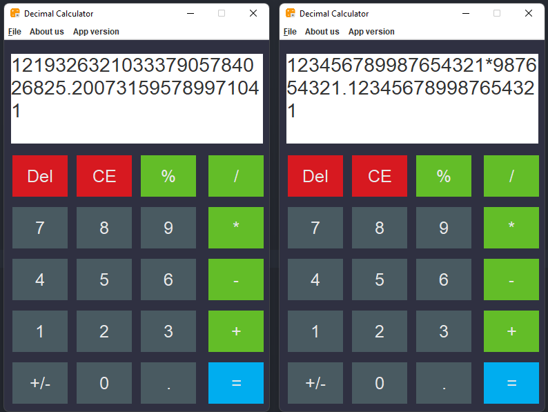

# Decimal-Calculator
This is a very small project that shows the answer with many decimal places. With Java and swing.

# Hi friends:hand: 
It must have occurred to you that you want high-precision decimal digits, but the calculators do not show it to you. 
It happened to me too and it got on my nerves! That's why I said to fix the calculator when I'm unemployed and to meet this need. 
This program is very simple and still needs to debug and correct parts of the program logic. Not finished yet but it does my job very well and from it. 
This program is input data in terms of Big Decimal and because of these numbers, it displays a lot of decimals and is very accurate. Performs four main functions, 
which are multiplication, division, squatting and subtraction, along with percentage. 
This program is written in Java language and its graphics are written by Java Swing. And it has a jar file that can be opened and used without a programming environment.

## preview of decimal calculator

## I hope it was useful :)
